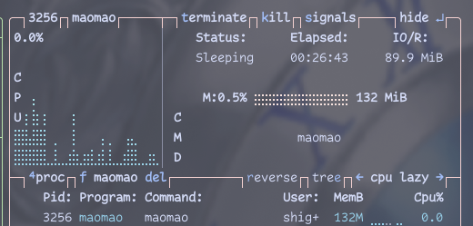
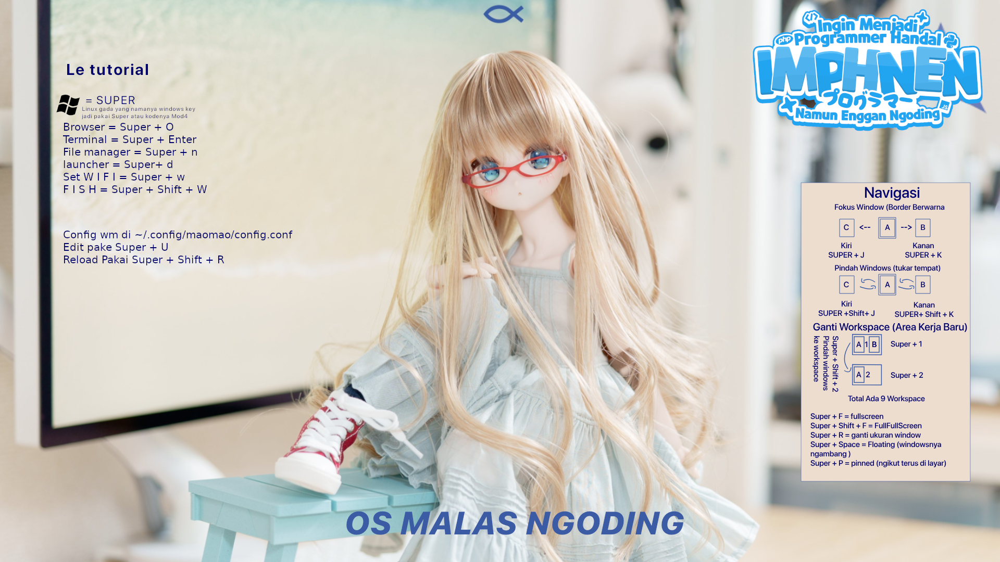

# IMPHNEN OS (BASED)
 
## Operating System Berbasis Fesnuk

Tujuan dibuatkan project gajelas ini ya karena buat memfasilitasi para member malas ngoding yang bukannya ngoding tapi malah buka fesnuk, ya daripad bolak bali ngoding fesnuk, ngoding fesnuk, ya langsung fesnuk aja gaperlu ngoding, 

## FITUR
- Live images (gaperlu ribet ngurusin installasi linux, trus ngehapus windows kalian) tinggal bikin bootable pakai rufus (``ingat pake mode DD jangan mode ISO``)
- Konek Wifi EZ (kali linux senggol ni boss)
- ~langsung buka fesnuk tanpa ba bi bu~
- ~cuman bisa buka fesnuk~
- ~fesnuk doang jir yang bisa~
- Sekarang Bisa Semua (Installernya belum jadi sih hehe :3).
- Sistem Ringan Karena pakai window manager MaoMao


## FITUR UPDAATEEEEEEE
Sekarang Sistemnya udah terintegrasi sama Window Manager MaoMaowm, yang berbasis [dwl](https://codeberg.org/dwl/dwl) yang mana lebih ringan (Daripada Hyprslop) dan ada animasi dan blur some shit you guys like, config eee mudah + ada sistem scrolling windows yang baru muncul di kancah per ricing an linuj, untuk ImphnenOs ini menggunakan layout scrolling secara default karena: 

- Lebih enak di perangkat yang memiliki layar sempit ( Laptop kao), jadi tidak terbatas dengan ukuran layar, jadi bisa banyak windows per workspacenya + more rajing mengodinj


- *windows preview*, fitur menampilkan windows yang ada, jadi gak ribet kalau cari windows (arahkan mouse ke kiri bawah layar)


- Ringan. cuman makan 100MB ram untuk fitur lengkap




## Cara buat
download ISO nya di sini

[ImphnenOs.iso](https://github.com/IMPHNEN/ImphnenOs/releases/download/Beta/ImphnenOs-2025.03.11-x86_64.iso) 

kemudian buat bootable menggunakan rufus / ventoy
``ingat untuk rufus pakai mode DD jangan ISO``
 
atau testing menggunakan Qemu (untuk vmware gatau dan malas mencari tahu)

```
qemu-system-x86_64 -cdrom lokasi/iso/nya.iso -boot d -m 2048
```


setelah boot akan keluar ~grub~(grub rusak bruh, gabisa boot) Systemd-boot / syslinuj , klik enter ae (yang paling atas atau yes fesnuk apalah)


Trus booting ke uuhhh, yes, 




buat user W I F I ! ! !. kalau di bar bawah ada tulisan merah "Disconnected" berarti gak konek internet. tekan dulu Windows + W buat setup wifi korang, trus Windows + O buat buka Brave.


## Installernya masih TO-DO list, belum beres, takut jir nanti media asusila kalian gak sengaja terhapuskan sehingga kalian tidak bisa melakukan aksi tidak terpuji di dalam kamar sendiri, jadi harus full testing dulu biar aman dipakai (baca: malas bikin installernya njing)

buat keluarnya klik tombol power hehe.

## KONTRIBUSI
buat korang yang pengen juga bantu kami (abodin doang sih), bisa bantu (plis)
dengan cara
- pakai arch btw linux 
- have some common sense
- menyukai dedek lembut
- bisa pakai git (opsional)
- masih normal (opsional)
- Bukan Pendukung Manchester United

### HOW-TO

install dulu archiso
```
sudo pacman -S archiso
```
sudah tuh clone ni repo
```
git clone https://github.com/Imphnen/ImphnenOs.git
```
kemudian modif atau apalah bebas yang penting jangan sampe kernel panic

buat iso
```
sudo mkarchiso -v -w /lokasi/workdir/bebas/tapi/kalau/udah/hapus -o
/lokasi/iso/nya.iso /lokasi/repo/ImphnenOs/releng

```
nanti buat jalankannya pakai run_archiso
```
run_archiso -i /lokasi/iso/nya.iso
```

begituwj
auk ah

## File penting
- airootfs = folder root live iso nya, jadi kesono edit something something
- packages.x86_64 = package yang di install (masukin filenya yang mau dipasang)
- profiledef.sh = file penting anjenggg, kalau misalnya menambahkan file ke
  airootfs wajib menambahkan ``file_permission`` 
```
file_permissions=(
  ["/etc/shadow"]="0:0:400"
  ["/root"]="0:0:750"
  ["/root/.automated_script.sh"]="0:0:755"
  ["/root/.gnupg"]="0:0:700"
  ["/root/.fesnuk"]="0:0:777"
  ["/root/wp.jpg"]="0:0:777"
  ["/usr/local/bin/choose-mirror"]="0:0:755"
  ["/usr/local/bin/dfwm"]="0:0:755"
  ["/usr/local/bin/st"]="0:0:755"
  ["/usr/local/bin/Installation_guide"]="0:0:755"
  ["/usr/local/bin/livecd-sound"]="0:0:755"
# ["/lokasi/filenyah/tanpa/airootfs/"]="0:0:755" 755 ae biar jalan, yang
penting jalan ga peduli safety, hehe
)
```
- airootfs/root = lokasi root directory pas boot dia homo directorynya disini,
  ada file penting kek .fesnuk buat auto run aplikasi (malas setting systemd)
just strapping some shit lately,
- airootfs/etc = sama kek /etc di linux kao, bisa ae copas dari linux mu biar
  cepet
- airootfs/usr/local/bin = buat nyimpen binary aplication kalau nambah gitu,
  jangan lupa tambahin file_permission di profiledef.sh
- airootfs/root/wp.jpg = boneka abodin

## TODO

- [.] bikin custom neofetch
- [x] bikin calamares installer (biar bisa install ni linuj jelek bin ampas) (M A L A S)
- [.] bikin windows manager (Sudah beres pakai maomaowm desuwa)
- [x] bikin webpage + Wiki (yang bisa webdev tolong bantu lah jir)
- [x] bikin repo server (uhh, biar repo yang di aur tinggal comot, ada beberapa package penting kek visual-studio-code (bukan oss-code), waydroid(buat native android app), proton-GE (gayming), terabox, dll)
- [x] Implementasi Aplikasi Bajakan, uwehhh


# Special Tanks
- Atmint dan Member Malas ngoding IMPHNEN (Ngoding sana lu njing) [malas](https://niyaniya.moe)
- MaoMao, The creator of maomaowm. [Linknya](https://github.com/DreamMaoMao/maomaowm)
- Bapak Joko Widodo yang senantiasa membangun indonesia. H I D U P  J O K O W I

