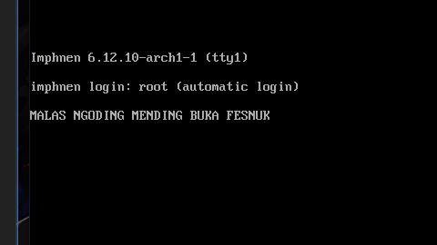
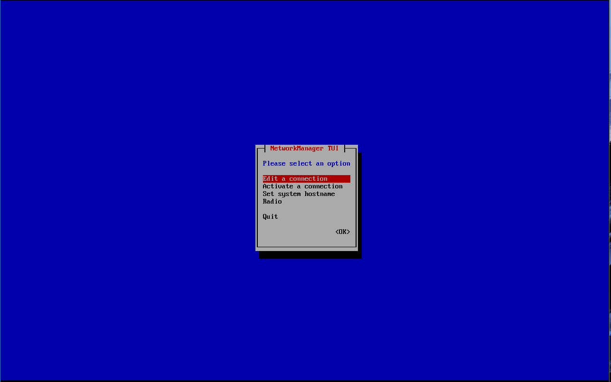

# IMPHNEN OS (BASED)
 
## Operating System Berbasis Fesnuk

Tujuan dibuatkan project gajelas ini ya karena buat memfasilitasi para member malas ngoding yang bukannya ngoding tapi malah buka fesnuk, ya daripad bolak bali ngoding fesnuk, ngoding fesnuk, ya langsung fesnuk aja gaperlu ngoding, 

## FITUR
- Live images (gaperlu ribet ngurusin installasi linux, trus ngehapus windows kalian) tinggal bikin bootable pakai rufus (``ingat pake mode DD jangan mode ISO``)
- Konek Wifi EZ (kali linux senggol ni boss)
- langsung buka fesnuk tanpa ba bi bu
- cuman bisa buka fesnuk
- fesnuk doang jir yang bisa


## Cara buat
download ISO nya di sini

[IphnenOs.iso](https://yadi.sk/d/ZN1YW-uw2pcsBQ) 

kemudian buat bootable menggunakan rufus / ventoy
``ingat untuk rufus pakai mode DD jangan ISO``
 
atau pakai qemu (kalau pro dan rajin ngoding)
```
qemu-system-x86_64 -cdrom lokasi/iso/nya.iso -boot d -m 2048
```

 


setelah boot akan keluar grub, klik enter ae (masih WIP JIR jadi belum pakai custom grub masih bawaan arch btw linuk)


nanti setelah boot akan keluar network manager (layar kao warna biru) untuk navigasi menggunakan arrow atas bawah kiri kanan kotak x segitiga enter, untuk user wifi masuk dahulu ke "Activate a connection" buat konek wingfi nyah, udah itu klik exit, langsung buka fesnuk.

 

buat keluarnya klik tombol power hehe.

